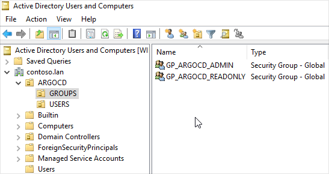
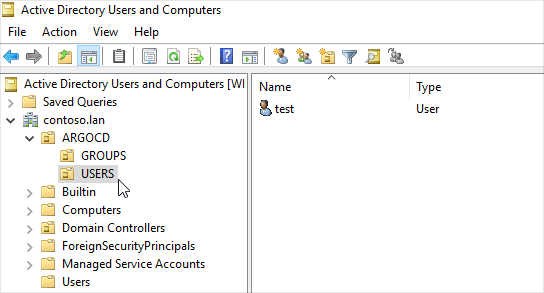
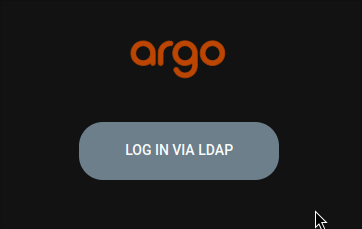
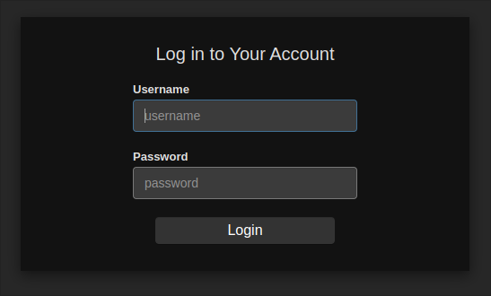

## Argocd using LDAP on windows server
In this example we will log in on argocd using ldap user

### First install argocd on kubernetes
```
kubectl create namespace argocd
kubectl apply -n argocd -f https://raw.githubusercontent.com/argoproj/argo-cd/stable/manifests/install.yaml
```

### My windows server active directory config
- Domain: contoso.lan
- Admin user: Administrator
- Machine IP: 10.11.12.19
- I created a organizational unit called "ARGOCD" and another two OUs inside called "USERS" and "GROUPS"
- I created two groups "GP_ARGOCD_ADMIN" and "GP_ARGOCD_READONLY" in GROUS OU


- And a user "test" inside OU "USERS"



### Create a file argocd-cm.yaml and fill the configuration specs
Pay atention to # comment statements
```
apiVersion: v1
data:
  dex.config: |-
    logger:
      level: debug
    connectors:
    - type: ldap
      name: contoso.lan # Customizable name
      id: ldap
      config:
        # Ldap server address
        host: "10.11.12.19:389" # My domain address (it can be dns name)
        insecureNoSSL: true # I have no ssl configured
        insecureSkipVerify: true
        # Variable name stores ldap bindDN in argocd-secret
        bindDN: "administrator@contoso.lan" # you can refer a secret using "$dex.ldap.bindDN" 
        # Variable name stores ldap bind password in argocd-secret
        bindPW: "*********" # you can refer a secret using "$dex.ldap.bindPW" 
        usernamePrompt: Username
        # Ldap user search attributes
        userSearch:
          baseDN: "OU=USERS,OU=ARGOCD,DC=contoso,DC=lan" # Here you put your DN to search users
          filter: "(objectClass=user)" # This object class can be variable while using another ldap server
          username: cn
          idAttr: cn
          emailAttr: cn
          nameAttr: cn
        # Ldap group serch attributes
        groupSearch:
          baseDN: "OU=GROUPS,OU=ARGOCD,DC=contoso,DC=lan" # Here you put your DN to search groups
          filter: "(objectClass=group)" This object class can be variable while using another ldap server
          userAttr: dn
          groupAttr: member # Here is what attribute match with the user cn
          nameAttr: cn
  url: https://localhost:8080 # You argocd url (i'm using port-forward)
  admin.enabled: "false" # Here is to disable argocd login using default admin account
  server.rbac.log.enforce.enable: "true"
kind: ConfigMap
metadata:
  labels:
    app.kubernetes.io/name: argocd-cm
    app.kubernetes.io/part-of: argocd
  name: argocd-cm
  namespace: argocd
```

### Now configure the RBAC creating a file argocd-rbac-cm.yaml
```
apiVersion: v1
kind: ConfigMap
metadata:
  name: argocd-rbac-cm
  namespace: argocd
data:
  policy.default: role:none
  scopes: '[groups, uid]' # I don't understand why we have to configure this, but without won't work
  policy.csv: |
    p, role:none, *, *, */*, deny # This means that if the user have no group, the role is none and have no permissions
    g, GP_ARGOCD_ADMIN, role:admin # This is the group of active directory where user stands and permissions
    g, GP_ARGOCD_READONLY, role:readolny # Another group to play with
```


### Apply the configmaps
> kubectl apply -f argocd-cm.yaml

> kubectl apply -f argocd-rbac-cm.yaml


### Access your argocd server
If you are using a local cluster you can access your argocd server typing
- > kubectl -n argocd port-forward svc/argocd-server 8080:80

- Now you can access your argocd server and the only option is to login via LDAP (or the name you gave)


- After click you will be redirected to dex and you can authenticate with your domain user




# Conclusion
With LDAP authentication you can federate the users across your company. You will have to 
control the RBAC using the argocd-rbac-cm configmap, but the users and groups will be imported
from active directory.

### REF
- [how-to-setup-ldap-and-openldap-for-argocd]([https://www.opsmx.com/blog/how-to-setup-ldap-and-openldap-for-argocd)
- [Argocd documentation](https://argo-cd.readthedocs.io/en/stable/operator-manual/user-management/)
